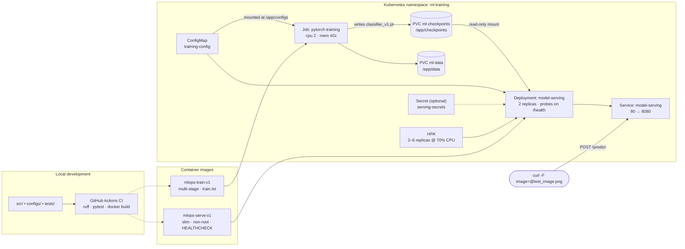

# mlops-pytorch-pipeline

A PyTorch image classifier taken through the full deployment lifecycle: local
development, containerised training, and orchestrated training + serving on
Kubernetes.

* **Model** — ResNet-18 (CIFAR-adapted stem) or a small from-scratch CNN, on CIFAR-10
* **Training** — a config-driven Job that writes a checkpoint to a PersistentVolumeClaim
* **Serving** — a FastAPI service, 2 replicas behind a ClusterIP Service with an HPA
* **CI** — ruff, pytest, manifest contract tests, and both image builds on every PR

MLOps & Infrastructure for Machine Learning — Assignment 2 (Docker & Kubernetes).

---

## Architecture



The training Job and the serving Deployment share exactly one artifact: the
checkpoint on `ml-checkpoints`. Everything the serving side needs to rebuild the
model — architecture, `num_classes`, dataset, class names — is stored *inside*
the checkpoint, so `mlops-serve` never reads the training config.

---

## Repository layout

```
mlops-pytorch-pipeline/
├── src/
│   ├── model.py                # SimpleCNN + CIFAR-adapted ResNet-18, checkpoint → model
│   ├── dataset.py              # transforms, DataLoaders, shared inference transform
│   ├── train.py                # config/env-driven training loop, JSON-lines metrics
│   └── serve.py                # FastAPI: /predict, /health, /reload
├── configs/training_config.yaml
├── docker/
│   ├── Dockerfile.train        # multi-stage, venv-only runtime, non-root
│   └── Dockerfile.serve        # slim, inference deps only, HEALTHCHECK, non-root
├── k8s/
│   ├── namespace.yaml          # ml-training
│   ├── configmap.yaml          # training-config (YAML file) + serving-config (env)
│   ├── training-job.yaml       # 2 PVCs + the training Job
│   ├── training-job-gpu.yaml   # bonus: nvidia.com/gpu + nodeSelector/toleration
│   ├── serving-deployment.yaml # 2 replicas, probes, rolling update
│   ├── serving-service.yaml    # ClusterIP 80 → 8080
│   ├── hpa.yaml                # 2–6 replicas
│   └── secret.example.yaml     # template; the real Secret is never committed
├── requirements/{train,serve,dev}.txt   # fully pinned
├── scripts/
│   ├── make_test_image.py      # writes test_image.png from the CIFAR-10 test split
│   ├── verify_docker.sh        # Part C evidence → docs/evidence/docker.md
│   └── verify_k8s.sh           # Part F evidence → docs/evidence/k8s.md
├── tests/                      # model, serving API, training config, manifests
└── .github/workflows/ci.yml
```

---

## 1. Local setup

```bash
python3 -m venv .venv
.venv/bin/pip install -r requirements/serve.txt -r requirements/dev.txt
.venv/bin/pytest -v          # 41 tests, no dataset download required
.venv/bin/ruff check src tests
```

`src/` is a flat module directory, not a package: both containers run their
entrypoint as a script (`python src/train.py`), which puts `src/` on `sys.path`
automatically. `tests/conftest.py` does the same.

Run training outside Docker (Apple silicon picks the `mps` device automatically,
which is roughly an order of magnitude faster than the CPU-bound container —
there is no Metal passthrough into Docker's Linux VM):

```bash
CONFIG_PATH=configs/training_config.yaml \
TRAIN_DATA_DIR=./data CHECKPOINT_DIR=./checkpoints \
TRAIN_EPOCHS=1 TRAIN_MAX_TRAIN_BATCHES=50 \
.venv/bin/python src/train.py
```

Checkpoints are device-agnostic — `serve.py` always loads with
`map_location="cpu"` — so a checkpoint trained on `mps` or `cuda` is served
unchanged by the container and by the cluster.

## 2. Docker

```bash
# Training image (multi-stage)
docker build -f docker/Dockerfile.train -t mlops-train:v1 .

# Full 10-epoch run, config + data + checkpoints all mounted
mkdir -p data checkpoints
docker run --rm \
  -v $(pwd)/data:/app/data \
  -v $(pwd)/checkpoints:/app/checkpoints \
  mlops-train:v1

# ...or a 1-2 minute smoke run using env overrides
docker run --rm \
  -v $(pwd)/data:/app/data \
  -v $(pwd)/checkpoints:/app/checkpoints \
  -e TRAIN_ARCHITECTURE=simple_cnn -e TRAIN_EPOCHS=2 \
  -e TRAIN_MAX_TRAIN_BATCHES=60 -e TRAIN_MAX_VAL_BATCHES=20 \
  mlops-train:v1

# Serving image
docker build -f docker/Dockerfile.serve -t mlops-serve:v1 .
docker run --rm -p 8080:8080 -v $(pwd)/checkpoints:/app/checkpoints mlops-serve:v1

# In another shell
curl -s http://localhost:8080/health
python3 scripts/make_test_image.py                      # writes test_image.png
curl -X POST http://localhost:8080/predict -F "image=@test_image.png"
```

`scripts/verify_docker.sh` runs all of the above and tees the transcript into
`docs/evidence/docker.md`.

Both Dockerfiles install torch from **PyTorch's CPU wheel index**
(`TORCH_INDEX_URL`, defaulted for you), with PyPI as a fallback for everything
else. This is not a micro-optimisation: torch 2.11's PyPI wheel declares
`cuda-toolkit; platform_system == "Linux"` with no architecture guard, so a plain
`pip install torch` pulls ~2.4 GB of `nvidia-*` wheels — cublas, cudnn, nccl,
triton — even on arm64, into an image with no GPU to use them. Each Dockerfile
asserts the result and **fails the build** if any CUDA package is present.

## 3. Kubernetes

Any single-node cluster works. Docker Desktop is the shortest path because
locally built images are already in the cluster's image store:

| Cluster | Enable | Make images visible |
|---|---|---|
| Docker Desktop | Settings → Kubernetes → *Enable Kubernetes* | nothing to do |
| minikube | `minikube start --cpus 4 --memory 8192` | `minikube image load mlops-train:v1` (and `mlops-serve:v1`) |
| kind | `kind create cluster` | `kind load docker-image mlops-train:v1 mlops-serve:v1` |

Both manifests use `imagePullPolicy: IfNotPresent`, so the cluster never tries to
pull `mlops-train:v1` from a registry.

```bash
# Training
kubectl apply -f k8s/namespace.yaml
kubectl apply -f k8s/configmap.yaml
kubectl apply -f k8s/training-job.yaml
kubectl logs -f job/pytorch-training -n ml-training

# Serving, once the Job reports Complete
kubectl apply -f k8s/serving-deployment.yaml
kubectl apply -f k8s/serving-service.yaml
kubectl apply -f k8s/hpa.yaml

kubectl get pods -n ml-training
kubectl describe deployment model-serving -n ml-training

# Predict through the Service
kubectl port-forward svc/model-serving 8080:80 -n ml-training
curl -X POST http://localhost:8080/predict -F "image=@test_image.png"
```

`scripts/verify_k8s.sh` runs the whole sequence — including a rolling restart to
show `maxUnavailable: 0` keeps the Service serving — into `docs/evidence/k8s.md`.

Apply the manifests **individually**, as above. `kubectl apply -f k8s/` would also
create the placeholder Secret and the GPU Job variant.

### Fast-demo overrides in the Job

`k8s/training-job.yaml` sets `TRAIN_EPOCHS=3` and truncates each epoch so a
CPU-only node finishes in minutes. Everything else still comes from the
ConfigMap. A Job's pod template is immutable, so the full 10-epoch run means
re-creating it:

```bash
kubectl delete job pytorch-training -n ml-training
# remove the three TRAIN_* env entries from k8s/training-job.yaml
kubectl apply -f k8s/training-job.yaml
```

### GPU (bonus)

`k8s/training-job-gpu.yaml` is the same Job with `nvidia.com/gpu: 1`, a
`nodeSelector` for `accelerator: nvidia-gpu`, a toleration for the
`nvidia.com/gpu` taint, a memory-backed `/dev/shm`, and `TRAIN_DEVICE=cuda`.
It needs a GPU node pool with the NVIDIA device plugin installed.

---

## Configuration

Precedence, lowest to highest:

1. `configs/training_config.yaml` baked into the image (fallback)
2. the file mounted at `/app/configs/training_config.yaml` (bind mount / ConfigMap)
3. `CONFIG_PATH=/somewhere/else.yaml`
4. `TRAIN_*` environment variables

| Env var | Config key | Notes |
|---|---|---|
| `TRAIN_ARCHITECTURE` | `model.architecture` | `resnet18` \| `simple_cnn` |
| `TRAIN_EPOCHS` | `training.epochs` | |
| `TRAIN_BATCH_SIZE` | `training.batch_size` | |
| `TRAIN_LEARNING_RATE` | `training.learning_rate` | |
| `TRAIN_EARLY_STOPPING_PATIENCE` | `training.early_stopping_patience` | |
| `TRAIN_MAX_TRAIN_BATCHES` / `TRAIN_MAX_VAL_BATCHES` | `training.max_*_batches` | `0` = full epoch |
| `TRAIN_DEVICE` | `training.device` | `auto` \| `cpu` \| `cuda` \| `mps` |
| `TRAIN_DATASET` / `TRAIN_DATA_DIR` / `TRAIN_NUM_WORKERS` | `data.*` | `cifar10` \| `fashion_mnist` |
| `CHECKPOINT_DIR` / `MODEL_NAME` | `output.*` | |

Serving reads `CHECKPOINT_PATH`, `SERVE_PORT`, `TORCH_NUM_THREADS`, `TOP_K`,
`LOG_LEVEL` (from the `serving-config` ConfigMap) and `MODEL_API_KEY` (from the
optional `serving-secrets` Secret).

## API

| Method | Path | Behaviour |
|---|---|---|
| `GET` | `/health` | `200` with model metadata once a checkpoint is loaded, `503` otherwise. Backs both probes and the Docker `HEALTHCHECK`. |
| `POST` | `/predict` | multipart field `image` (`file` also accepted) → predicted class, full probability distribution, top-k, latency |
| `POST` | `/reload` | re-reads the checkpoint, so pods started before the Job finished pick it up without a restart |
| `GET` | `/` | service metadata |

```json
{
  "filename": "test_image.png",
  "predicted_class": "cat",
  "predicted_index": 3,
  "confidence": 0.7421,
  "probabilities": {"airplane": 0.0031, "automobile": 0.0007, "...": 0.0},
  "top_k": [{"class": "cat", "probability": 0.7421}],
  "inference_ms": 12.4,
  "model": {"architecture": "resnet18", "trained_epoch": 7, "val_accuracy": 0.8123}
}
```

Training metrics are JSON lines on stdout, so `kubectl logs` is machine-readable:

```json
{"ts": "2026-08-30T12:42:43+00:00", "event": "epoch_metrics", "epoch": 1, "train_loss": 1.4102, "train_accuracy": 0.4881, "val_loss": 1.1207, "val_accuracy": 0.6015, "epoch_seconds": 71.4}
{"ts": "2026-08-30T12:43:55+00:00", "event": "checkpoint_saved", "path": "/app/checkpoints/classifier_v1.pt", "epoch": 1}
```

## Secrets

Nothing secret is committed: `.gitignore` covers `.env*`, `*.pem`, `*.key`,
`kubeconfig` and `k8s/secret.yaml`; only `k8s/secret.example.yaml` is tracked. To
turn on API-key auth:

```bash
kubectl create secret generic serving-secrets \
  --from-literal=MODEL_API_KEY="$(openssl rand -hex 24)" -n ml-training
kubectl rollout restart deployment/model-serving -n ml-training
curl -X POST http://localhost:8080/predict \
  -H "X-API-Key: <value>" -F "image=@test_image.png"
```

The Deployment references the Secret with `optional: true`, so the service runs
unauthenticated until that Secret exists.

## Design notes

* **Multi-stage builds** — stage 1 installs the pinned wheels into `/opt/venv`;
  stage 2 copies only that venv, so pip, its cache and build metadata never ship.
  Requirements are copied before `src/`, so editing code rebuilds three layers.
* **Two requirement files** — `serve.txt` has no `tensorboard`; CI asserts that
  the serving image cannot `pip show tensorboard`.
* **No CUDA in a CPU image** — torch's PyPI metadata requires `cuda-toolkit` on
  all of Linux, arm64 included. Both builds install from the CPU wheel index and
  then fail if a single `nvidia-*` package made it in, which keeps the "slim,
  inference-only" claim honest instead of aspirational.
* **Non-root everywhere** — uid/gid 1001 baked into both images and pinned again
  in the pod `securityContext` (`runAsNonRoot`, `fsGroup: 1001` so the PVCs are
  writable). Serving additionally runs with `readOnlyRootFilesystem` and all
  capabilities dropped, with an `emptyDir` for `/tmp`.
* **Atomic checkpoints** — `torch.save` writes `*.pt.tmp` then `os.replace`, so a
  serving pod reading the shared PVC can never load a half-written file.
* **Graceful shutdown** — `SIGTERM` is caught and training stops at the next
  epoch boundary with its checkpoint intact, rather than dying mid-batch.
* **Manifest contract tests** — `tests/test_manifests.py` asserts the replica
  count, probe timings, resource requests/limits, mount paths and rolling-update
  policy, so a bad YAML edit fails CI instead of the cluster.

## Git workflow

`main` ← `develop` ← `feature/*`, Conventional Commits, every feature branch
merged through a reviewed PR:

| PR | Branch | Scope |
|---|---|---|
| 1 | `feature/pytorch-model` | model, dataset, training loop, config, unit tests, CI |
| 2 | `feature/docker-training` | multi-stage training image, `.dockerignore`, Makefile |
| 3 | `feature/model-serving` | FastAPI app, serving image, API tests |
| 4 | `feature/k8s-deployment` | namespace, ConfigMaps, PVCs, Job, Deployment, Service, HPA |
| 5 | `feature/docs-and-validation` | README, architecture diagram, captured evidence |
| 6 | `develop → main` | release PR carrying the Part C and Part F transcripts |

## Troubleshooting

| Symptom | Cause / fix |
|---|---|
| Job pod stuck `Pending` | Node cannot satisfy `cpu: 2` / `memory: 4Gi`. Raise Docker Desktop to ≥4 CPU / 8 GB, or lower the request. |
| `ErrImagePull` / `ImagePullBackOff` | The cluster cannot see the local image. `minikube image load` / `kind load docker-image`, or rebuild inside Docker Desktop. |
| Serving pods never become ready | No checkpoint on the PVC yet. `kubectl logs -l app=model-serving -n ml-training` shows `model_load_failed`; wait for the Job, then `POST /reload`. |
| `PersistentVolumeClaim ... is being deleted` | The namespace was deleted while pods still held the PVCs. Wait for finalisers, then re-apply. |
| HPA `TARGETS` shows `<unknown>` | metrics-server is not installed: `minikube addons enable metrics-server`. On Docker Desktop, install it and add `--kubelet-insecure-tls` to its args — the kubelet's serving cert is not signed for the node IP, so it otherwise never becomes ready. |
| Permission denied writing `/app/checkpoints` (local Docker) | `mkdir -p checkpoints && chmod 777 checkpoints`, or add `--user 0` to that one `docker run`. |

## Attribution

Written with AI assistance (Claude Code) for scaffolding and review; every file
was reviewed, adapted and verified locally. Commit messages that contain
AI-assisted work are marked accordingly, per the course's academic-integrity
policy.
